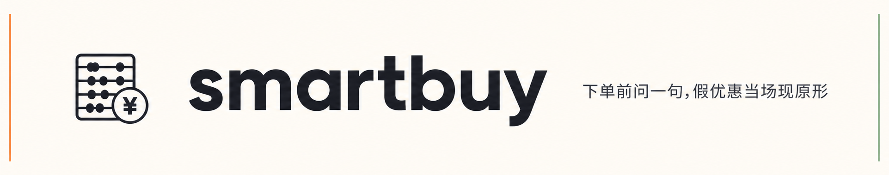

<p align="center">
  
</p>

<p align="center">
  三个 Claude Code skill 帮你在国内电商真省钱 —— 用真实数据,绝不编。
</p>

<p align="center">
  <a href="https://github.com/your-github-username/smartbuy-skills"></a>
  <a href="LICENSE"></a>
  
</p>

---

## 是什么

smartbuy 是装在 [Claude Code](https://docs.claude.com/en/docs/claude-code) 里的对话式 AI 购物助手。三个 skill 协作覆盖一次完整的购物决策:

- **price-detective** —— 这价划算吗?
- **coupon-stacker** —— 凑券实付多少?
- **promo-predictor** —— 等大促能更低吗?

三个都从京东 / 慢慢买 / IT之家 等真实来源抓数据,**拿不到就明说,绝不编一个数字**。

## 快速开始

```bash
# 先装 Claude Code: https://docs.claude.com/en/docs/claude-code

# 装主 skill(单装也能用)
npx skills add your-github-username/smartbuy-skills/skills/price-detective

# 完整三件套(可选)
npx skills add your-github-username/smartbuy-skills/skills/coupon-stacker
npx skills add your-github-username/smartbuy-skills/skills/promo-predictor
```

装好后在 Claude Code 里直接说人话:

```text
罗技 MX Master 3S 京东 499,该买吗?
```

更多安装方式见 [`install.md`](install.md)。

## 它能帮你看穿什么

<p align="center">
  
</p>

划线价 ¥3999、实际 6 个月一直就 ¥1599 —— 这种假优惠你被骗过几次?

装好之后下单前问一句,它真的去查 + 真的给你判断,而且推测信号必标置信度。

## 三个 skill 在做什么

<p align="center">
  
</p>

| skill | 你问它什么 | 它给你 |
|---|---|---|
| **price-detective** | 这价划算吗? | 一句判断 + 跨平台横评 + 历史一句话 + 戳穿假优惠 |
| **coupon-stacker** | 凑券实付多少? | 按 2026 京东自营真实规则精确算实付 + 下单页操作步骤 |
| **promo-predictor** | 等大促能更低吗? | 基于真实历史曲线的区间预测 + 置信度 + 价格预警 URL |

## 覆盖品类

**给硬判断**:3C / 手机 / 电脑 / 平板 / 数码外设 / 大小家电 / 游戏机 / 国际大牌护肤美妆(雅诗兰黛 / 兰蔻 / SK-II / 修丽可 等)

**走退路给参考**:服饰 / 球鞋 / 食品 / 国货护肤 / 香水彩妆 —— 主动给你慢慢买 / 得物 / 什么值得买 App 链接

**永远不做**:品类推荐(帮我选什么手机)/ 短期价格预测(明天会降到多少)/ 替你下单

## 核心承诺

跟所有"AI 比价"的本质差别:

- **不编价格** —— 抓不到就说,不用看起来合理的数字填空
- **措辞匹配置信度** —— 推测信号(下一代何时发、政策怎么变)只能用温和措辞 + 置信度标签,只有官方公告才下硬结论。绝不写"M5 一定 6 月发"
- **不替你下单** —— 给信号让你权衡,永远附"以下情况你可以买 / 以下情况建议等" 双向选项
- **数据来源透明** —— 每个数字标"何时何地抓的",推测信号末尾附原始新闻链接让你自己核验
- **搞不定时给工具** —— 抓不到曲线就给慢慢买 / 购物党 / 得物 App 链接,不假装无所不能

完整红线规则见 [`shared/no-fabrication.md`](shared/no-fabrication.md)(10 条 RULE + 数据三件套硬约束)。

## 文档

- [`install.md`](install.md) —— 完整安装指南 + 验证步骤
- [`shared/no-fabrication.md`](shared/no-fabrication.md) —— 红线规则全文

## License

MIT —— 蒸馏方法源自 [SkillAlchemy](https://github.com/agentsope/SkillAlchemy)。
